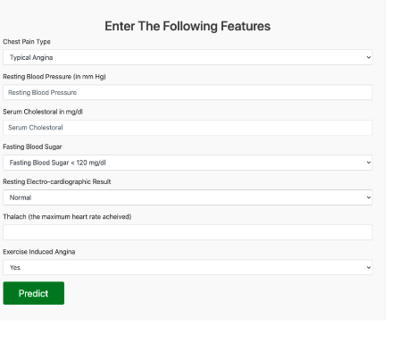

## About the Project
This web application enables healthcare professionals to input patient data and receive predictions about potential health outcomes using advanced machine learning models.

### Technologies
- Python
- Flask
- Scikit-learn
- JavaScript HTML/CSS
## **6. Usage**
## Usage
1. Clone the repository: git clone https://github.com/AbdulkadirDuran/Machine-learning-healthcare-web-app.git
2. Navigate to the project directory: cd Machine-learning-healthcare-web-app
3. Install dependencies: pip install -r requirements.txt
4. Run the application: python app.py
5. Navigate to `http://localhost:5000` after running the app.
6. Enter patient details into the form.
7. Click "predict" to see predictions as shown the screenshot below.

